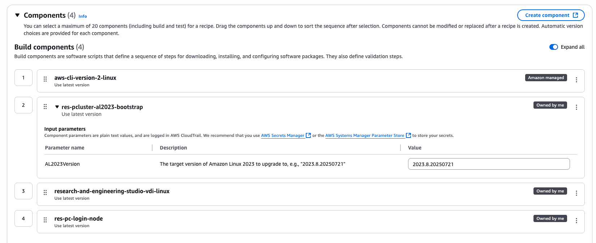
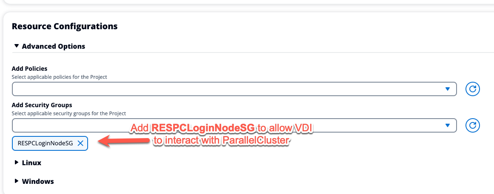
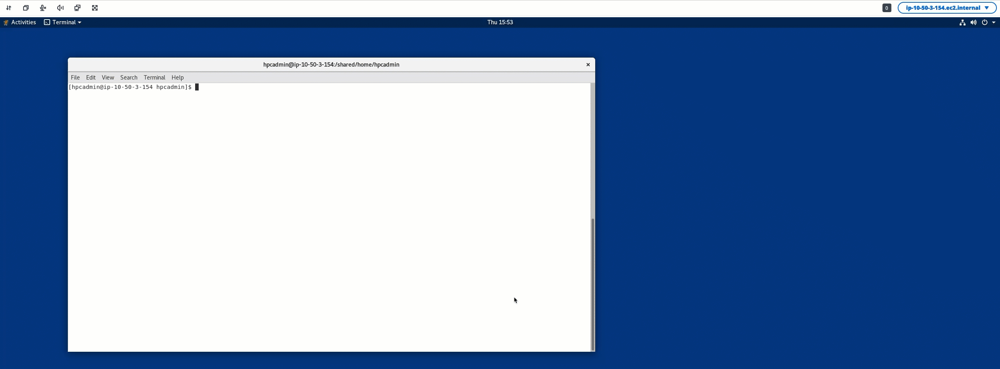

# Login Node for Research and Engineering Studio (RES)

## Info

This recipe allows the creation of a [ParallelCluster (PC) Login Node](https://docs.aws.amazon.com/parallelcluster/latest/ug/login-nodes-v3.html) AMI compatible with [Research and Engineering Studio (RES)](https://github.com/aws/res). The Login Node AMI can be used in a RES as a software stack to integrate with ParallelCluster.

## Requirements

This recipe is designed to be compatible with ParallelCluster environments that use an Amazon Linux 2023 (AL2023) Login Node. Ensure your ParallelCluster deployment meets this requirement before proceeding with the integration.

## Usage

### 1. Create RES compatible ParallelCluster Login Node AMI

To create a RES compatible ParallelCluster (PCluster) Login Node AMI, complete the following tasks. These steps prepare a custom AMI that will be compatible with RES and can be used as a software stack for integration with ParallelCluster.

#### 1.1. Deploy PCluster Login Node AMI automation

You can launch this template by following this quick-create link: [](https://console.aws.amazon.com/cloudformation/home?region=us-east-1#/stacks/create/review?stackName=loginnode-for-res&templateURL=https://aws-hpc-recipes.s3.us-east-1.amazonaws.com/main/recipes/pcluster/login_node_for_res/assets/main.yml)

If you don't wish to use the quick-create link, you can also download the [assets/main.yml](assets/main.yml) file and upload it to [AWS CloudFormation console](https://console.aws.amazon.com/cloudformation).

#### 1.2. Create RES-compatible ParallelCluster Login Node AMI

Trigger the SSM automation to create an AMI of the Login Node for ParallelCluster. This AMI ID will be used later on during the **EC2 Image Builder recipe** configuration.

1. Download [configure_login_node_for_res.sh](assets/configure_login_node_for_res.sh).
2. Run `configure_login_node_for_res.sh` once your Login Node is ready for snapshot. Update the following parameters accordingly.
   1. `SSM_DOCUMENT` = `ConfigureLoginNodeforRES` CloudFormation output value from Step 1.1
   2. `PCLUSTER_STACK_NAME` = ParallelCluster stack name

```bash
Usage: ./configure_login_node_for_res.sh <SSM_DOCUMENT> <PCLUSTER_STACK_NAME>
```

**Note:** If execution times out, check Systems Manager for the Automation execution.
_Systems Manager -> Automation -> {{execution id from command output}}_
e.g. `cd95c7b6-9999-aaaa-9beb-7c4bdbd57900`

_sample output_

```
[-] Automation execution started with ID: cd95c7b6-9999-aaaa-9beb-7c4bdbd57900
[-] Waiting for automation execution to complete... Retrying in 20s
[-] Waiting for automation execution to complete... Retrying in 20s
[-] Waiting for automation execution to complete... Retrying in 20s
[-] Waiting for automation execution to complete... Retrying in 20s
[-] Waiting for automation execution to complete... Retrying in 20s
[-] Waiting for automation execution to complete... Retrying in 20s
[-] Waiting for automation execution to complete... Retrying in 20s
[-] Waiting for automation execution to complete... Retrying in 20s
[-] Waiting for automation execution to complete... Retrying in 20s
[-] Waiting for automation execution to complete... Retrying in 20s
[-] Waiting for automation execution to complete... Retrying in 20s
[-] Automation execution completed successfully.
[-] Outputs: ami-xxxxxxxxxxxx
Done!
```

### 2. Configure RES-ready AMI

Follow the steps outlined in [configure RES-ready AMI(s)](https://docs.aws.amazon.com/res/latest/ug/res-ready-ami.html) to build the RES-ready AMI for a PC Login Node.

When [Preparing the EC2 Image Builder Recipe](https://docs.aws.amazon.com/res/latest/ug/res-ready-ami.html#prepare-recipe) please refer to the following:

1/ The Base image in _step 5_ should be the custom AMI that was created in Step 1.2 above.


2/ Add the following components to the recipe (_the sequence is important_).

| Component | Ownership | Parameters | Description |
|-----------|-----------|------------|-------------|
| `aws-cli-version-2-linux` | Amazon managed | None | Installs AWS CLI version 2 for Linux |
| `res-pcluster-al2023-bootstrap` | Owned by me | AL2023Version=2023.8.20250818 | Bootstraps the Amazon Linux 2023 environment integration with RES |
| `research-and-engineering-studio-vdi-linux` | Owned by me | None | Configures the Linux environment for RES compatibility |
| `res-pc-login-node` | Owned by me | None | Sets up the ParallelCluster login node functionality for RES |

The recipe should look as follows:



3/ In the **Storage** section update the Encryption (KMS Key) the following value: `/alias/aws/ebs`


### 3. Create / Update RES project

1/ Create or Update a project in RES and add the required Security Group under **Advanced Options**.  This is required to allow the desktop to communicate with the ParallelCluster Head Node.

**Security Group**: `RESPCLoginNodeSG`



### 4. Create Software stack in RES for Login Node

Create a Software Stack in RES which uses the new RES-ready AMI. Use the following steps to create a ParallelCluster LoginNode Software Stack in RES.

1.  Login to RES as an Administrator
2.  Select **Software Stacks**
3.  Select **Register Software Stack**
    1.  **Name**: LoginNode-<cluster-name>
    2.  **Description**: LoginNode for cluster <cluster-name>
    3.  **AMI ID**: <Output from `configure_login_node_for_res.sh`>
    4.  **Operating System**: <Select the OS used for the ParallelCluster - e.g. alinux2>
    5.  **Min Storage Size**: 40GB
    6.  **Min Ram**: 10GB
    7.  Select Project(s) to associate the stack.
    8.  Select **Submit**

### 5. Deploy Login Node Virtual Desktop

Deploy a Virtual Desktop using the newly created/updated project and Software stack.

You now have a Virtual Desktop instance capable of submitting jobs to ParallelCluster!



## Cost Estimate

Costs for this solution is less than $1.00/month.
